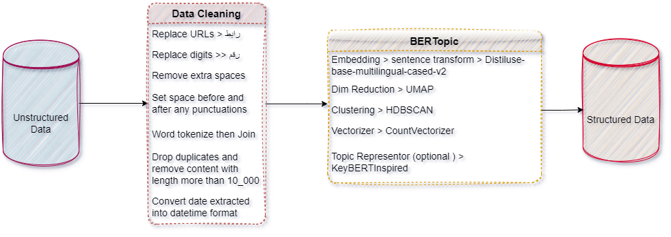

<h1 align="center">Hi 👋, it's a topic modeling project </h1>
<h3 align="center">
  
</h3>

- 🌱 If you have unstructured dataset and want to convert into structured dataset and want to explore how this happend, you are in the right repo..... 

- 🔭 this project inheritance from Eng [Abu Bakr Soliman](https://www.linkedin.com/in/bakrianoo/) (if you are arabian, i recommend to watch the crash course for topic modeling on [YouTube](https://www.youtube.com/watch?v=aDWB3u2ihy0&t=3118s) 

- 🌱 The Arabic dataset is fetched form HuggingFace 
